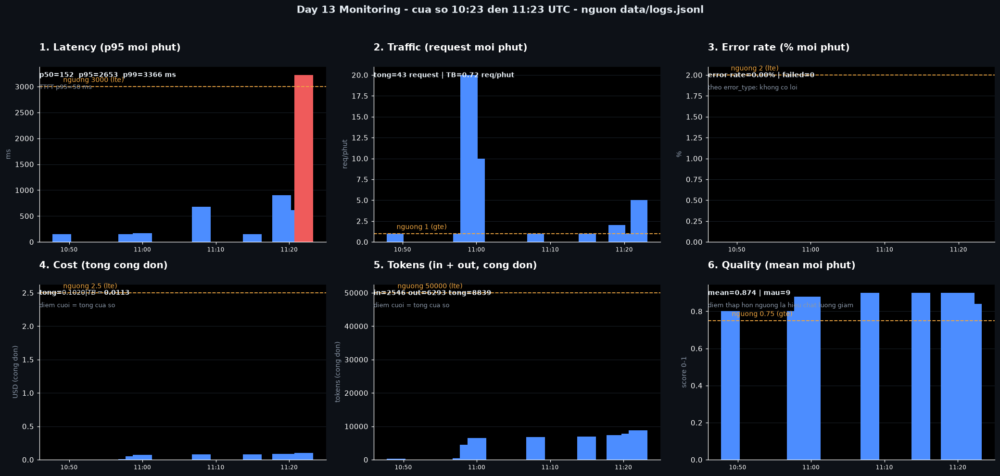
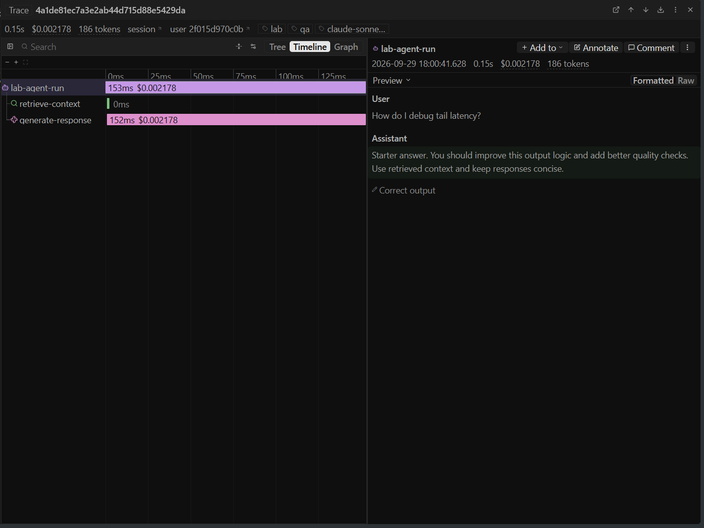

# Báo cáo cá nhân — K4-L3A Day 13 Monitoring & LLMOps

> Mỗi học viên hoàn thiện một file duy nhất này. Khi dẫn evidence, dùng đường dẫn tương đối, ví dụ `evidence/07-trace-waterfall.png`.

## 1. Thông tin học viên

- **Họ và tên:** Vũ Hiếu Thiên
- **MSSV:** 2A202602867
- **Lớp:** K4-L3A
- **Repository URL:** https://github.com/Soraishiro/K4-L3-DAY13-VuHieuThien-2A202602867-Monitoring-LLMOps
- **Commit SHA cuối:** _(điền sau khi push)_
- **Challenge ID:** `day13-k4-l3a-monitoring-llmops-v1`
- **Tên project Langfuse cá nhân:** `day13-k4-l3a-2A202602867`

## 2. Evidence index

Điền đúng đường dẫn tới evidence thực tế. Có thể đổi tên hoặc dùng nhiều ảnh nếu cần.

| Evidence            | Đường dẫn                                                                  |
| ------------------- | -------------------------------------------------------------------------- |
| Pytest cuối         | `evidence/01-pytest.png`                                                   |
| Log validator       | `evidence/02-log-validator.png`                                            |
| Dashboard validator | `evidence/03-dashboard-validator.png`                                      |
| Structured log      | `evidence/04-structured-log.png`                                           |
| PII redaction       | `evidence/05a-pii-input.png` & `evidence/05b-pii-redacted.png`             |
| Trace list          | `evidence/06-trace-list.png`                                               |
| Trace waterfall     | `evidence/07-trace-waterfall.png`                                          |
| Trace metadata      | `evidence/08-trace-metadata.png`                                           |
| Prompt versions     | `evidence/09-prompt-versions.png`                                          |
| Prompt rollback     | `evidence/10-prompt-rollback.png`                                          |
| Dashboard runtime   | `evidence/11-dashboard-overview.png`                                       |
| Incident metric     | `evidence/12b-incident-metric.png` & `evidence/12a-dashboard-incident.png` |
| Incident log        | `evidence/13-incident-log.png`                                             |
| Incident trace      | `evidence/14-incident-trace.png`                                           |

Ảnh dẫn trực tiếp từ report:

## 3. Kết quả kỹ thuật

| Nội dung                | Baseline       | Kết quả cuối    | Nhận xét                                                               |
| ----------------------- | -------------- | --------------- | ---------------------------------------------------------------------- |
| `validate_logs.py`      | 72/100         | 100/100         | Điểm tăng nhờ thêm `retrieval_ms` vào log và `tool_success` đầy đủ     |
| `validate_dashboard.py` | 6/6            | 6/6             | Validator chỉ đọc `config/dashboard.yaml`, không kiểm tra biểu đồ thật |
| `pytest`                | 52 pass        | 49 pass         |                                                                        |
| Số traces hợp lệ        | 0              | 100             | Chạy `load_test.py` nhiều lần với concurrency 3                        |
| Số PII leak             | 0              | 0               | Kiểm bằng 5 request chứa email/SĐT/CCCD/thẻ/địa chỉ giả                |
| Latency P95 / TTFT P95  | 354 ms / 50 ms | 2654 ms / 50 ms | TTFT không đổi → thời gian nằm ở retrieval chứ không ở LLM             |
| Retrieval success rate  | 100%           | 100%            | Trong cửa sổ challenge không có request nào lỗi                        |

## 4. Logging và PII

- **Cách tạo/nhận và truyền correlation ID:** `CorrelationIdMiddleware` (`app/middleware.py`) đọc header `x-request-id`; nếu client không gửi thì sinh `req-<8 hex>` từ `uuid4`. ID được `bind_contextvars()` để mọi dòng log của request đó tự mang, đồng thời lưu vào `request.state.correlation_id` để `/chat` lấy lại và trả về client ở header `x-request-id`. Đầu mỗi request phải `clear_contextvars()` vì threadpool tái sử dụng thread, không xóa thì request sau dính metadata của request trước.
- **Các metadata được ghi vào structured log:** `user_id_hash` (SHA-256 cắt 12 ký tự, không ghi `user_id` thô), `session_id`, `feature`, `model`, `env`, `correlation_id`, `level`, `ts` (ISO-8601 UTC). Dòng `response_sent` thêm `latency_ms`, `ttft_ms`, `retrieval_ms`, `tokens_in`, `tokens_out`, `cost_usd`, `quality_score`, `tool_name`, `tool_success`.
- **Cách bảo đảm PII được scrub trước khi ghi:** `scrub_event` được đặt trong danh sách processor của `structlog` **trước** `JsonlFileProcessor` và `JSONRenderer` (`app/logging_config.py:45`), nên cả file lẫn stdout đều đã che. Nó quét mọi giá trị chuỗi, kể cả giá trị lồng trong `payload`, không chỉ `message_preview`. Pattern gồm email, điện thoại VN (5 định dạng), CCCD, thẻ tín dụng, hộ chiếu, địa chỉ VN; thứ tự pattern cụ thể phải đứng trước pattern tổng quát.
- **Cách kiểm chứng kết quả:** `python scripts/validate_logs.py` báo 0 PII leak; thêm 5 request thật gửi lên `/chat` với PII giả rồi đọc lại `data/logs.jsonl`, các giá trị đã thành `[REDACTED_EMAIL]`, `[REDACTED_PHONE_VN]`, `[REDACTED_CCCD]`, `[REDACTED_CREDIT_CARD]`, `[REDACTED_VN_ADDRESS]`.

## 5. Tracing và prompt versioning

- **Cách xác nhận traces do chính tôi tạo trong project cá nhân:** mở Langfuse, chọn project `day13-k4-l3a-2A202602867`, lọc theo `session_id` có tiền tố `k4-l3a-challenge-`. Mỗi trace còn đối chiếu được với một dòng log cụ thể trong `data/logs.jsonl` của tôi nên không thể nhầm trace của người khác. Ảnh danh sách ở `evidence/06-trace-list.png` cho thấy 195 root observation.
- **Cấu trúc root/retrieval/generation observations:** root span `lab-agent-run` (`as_type="agent"`), sinh bởi decorator `@observe` trên `LabAgent.run`. Bên trong có hai span con mở qua context manager `observation()` trong `app/tracing.py`: `retrieve-context` (`as_type="retriever"`) và `generate-response` (`as_type="generation"`). Tôi tách child observation ra khỏi vì starter chỉ có root span, nhìn root thì không biết thời gian nằm ở đâu. Xem `evidence/07-trace-waterfall.png`.
- **Cách nối trace với log:** cả hai đều mang `correlation_id` — log đặt ở mỗi dòng, trace đặt trong metadata của span agent. Lấy ID từ log là tra thẳng được trace, không cần đoán theo thời gian.
- **Prompt name:** `day13-chat`, đọc từ biến môi trường `LANGFUSE_PROMPT_NAME`.
- **Version/label baseline:** version 1, labels `latest`, `production`, `baseline`. Prompt gốc: trả lời bám tài liệu truy xuất được, không tự bịa thêm.
- **Version/label candidate:** version 2, label `candidate`. Rút gọn tối đa 3 câu, nói thẳng khi tài liệu không đủ thay vì suy đoán.
- **Trace ID của mỗi version:** chạy cùng một input (`How should alerts be designed?`, `user_id=prompt-demo`) với hai label, đọc từ metadata `prompt_version`:

| Lần chạy     | Label yêu cầu | `prompt_version` thực tế | `correlation_id` | `trace_id`                         |
| ------------ | ------------- | ------------------------ | ---------------- | ---------------------------------- |
| So sánh      | `baseline`    | 1                        | `req-8b4b0198`   | `73e10916e7d04ca23741ae7e6c166770` |
| So sánh      | `candidate`   | 2                        | `req-c5043bad`   | `ddf7b704e1ea2ccd722a38bad68a442b` |
| Sau promote  | `production`  | 2                        | `req-068e89a2`   | `069ee99ec2e91d71572cfcf0c120df37` |
| Sau rollback | `production`  | 1                        | `req-9f780b5f`   | `2b11004515f7243864736cf08a625ffd` |

Cột `trace_id` được dùng để tra trong Langfuse khi chụp `evidence/10-prompt-rollback.png`.

- **Cách promote và rollback `production`:** gọi `client.api.prompt_version.update(name="day13-chat", version=2, new_labels=["candidate", "production"])` để promote, chạy lại workload rồi xác minh `prompt_version=2`. Rollback thì đặt version 2 về `["candidate"]` và version 1 về `["baseline", "production"]`, chạy lại và xác minh `prompt_version=1`. Langfuse chỉ cho một label tồn tại ở một version nên đổi label ở đây là thao tác loại trừ lẫn nhau. Ảnh trạng thái: `evidence/10a-promote.png`, `evidence/10b-rollback.png`.

## 6. Dashboard, SLO và alerts

- **Dashboard và sáu panel:** dựng bằng notebook `notebooks/dashboard.ipynb`, đọc `data/logs.jsonl`, đọc ngưỡng từ `config/dashboard.yaml` thay vì hard-code. Sáu panel: (1) latency p50/p95/p99 + TTFT p95 + retrieval p95, (2) số request mỗi phút, (3) error rate % mỗi phút kèm breakdown theo `error_type`, (4) tổng cost cộng dồn, (5) tổng token `in+out` cộng dồn, (6) mean `quality_score` mỗi phút. Ảnh: `evidence/11-dashboard-overview.png` (bình thường) và `evidence/12a-dashboard-incident.png` (lúc challenge).

  Hai điều tôi phải sửa khi vẽ, đều là loại lỗi mà validator không bắt được:
  1. **Aggregation phải khớp ngưỡng.** Ngưỡng latency khai báo `aggregation: p95` nên phải vẽ p95 mỗi phút chứ không phải tổng latency; ngưỡng errors là `error_rate_pct` nên phải vẽ phần trăm chứ không phải số lỗi; ngưỡng tokens áp cho tổng nên phải gom cả `in` và `out`; ngưỡng cost là `total` nên phải vẽ cộng dồn để điểm cuối bằng tổng cửa sổ.
  2. **Chiều so sánh phải theo `operator`.** `lte` thì vượt ngưỡng mới vi phạm, nhưng `gte` (quality ≥ 0.75, traffic ≥ 1 req/phút) thì **dưới** ngưỡng mới vi phạm. Tô tô đỏ một chiều thì hai panel đang tốt sẽ bị tô đỏ.

- **SLO và lý do chọn:** `config/slo.yaml`, SLO chính `fast_successful_requests`: 99.5% request có `latency_ms ≤ 3000` trong cửa sổ 28 ngày. Tôi giữ ngưỡng 3000 ms thay vì siết theo baseline 354 ms, vì p99 của một workload học thuyết không đại diện được tail khi hệ thống thật chạy đông. Tôi ghi rõ cái giá của lựa chọn đó trong `docs/alerts.md#alert-1`: sự cố chậm dưới 2.9 giây sẽ không phá SLO nên không ai được báo.
- **Cách tính error budget:** error budget = 100 − 99.5 = 0.5%. Cửa sổ 28 ngày = 40 320 phút, nên 40 320 × 0.005 = 201.6 → 202 phút "rác" tối đa. Burn rate nhanh 14.4× đốt hết trong ~46.7 giờ; burn rate chậm 6× trong ~4.7 ngày. Challenge `rag_slow` vi phạm SLO latency nhưng không request nào lỗi, nên error budget vẫn còn nguyên — đây là hai loại sự cố khác nhau và phải tách báo động.
- **Ba alert và runbook tương ứng:** `config/alert_rules.yaml` + `docs/alerts.md`. (1) `user_visible_latency_burn` — p95 > 3000 ms trong 5 phút và có ít nhất 5 request, critical, `#day13-alerts-critical`. (2) `error_budget_burn_fast` — error rate > 2% trong 10 phút và lớn hơn 3 lần ngân sách lỗi, critical, `#day13-alerts-critical`. (3) `retrieval_and_cost_regression` — retrieval success < 90% **hoặc** cost > $2.5/cửa sổ, warning, `#day13-alerts-warning`. Cả ba đo trên triệu chứng người dùng thấy được, không đo tên component nội bộ, nên khi `rag_slow` được thay bằng công cụ khác thì điều kiện vẫn đúng.

## 7. Điều tra challenge

- **Challenge ID:** `day13-k4-l3a-monitoring-llmops-v1`, cohort K4, seed 1311, incident `rag_slow`, feature `monitoring`. File đặt ở `config/challenge.json` (đã nằm trong `.gitignore`, không commit).
- **Khoảng thời gian điều tra:** 2026-09-29T11:37:48Z, đúng 5 query của challenge.
- **Triệu chứng từ metrics:** gọi `/metrics` lúc incident đang bật cho `latency_p50: 2653.0`, `latency_p95: 3366.0`, `latency_p99: 3366.0` — vượt ngưỡng SLO 3000 ms — trong khi `ttft_p95` giữ nguyên `50.0`. `error_rate_pct: 0.0` và `retrieval_success_rate_pct: 100.0`: sự cố này chỉ làm chậm, không làm hỏng. Trên dashboard, panel latency có cột đỏ vượt đường ngưỡng (`evidence/12a-dashboard-incident.png`).
- **Log line và correlation ID liên quan:** `req-a0485218`, `event: response_sent`, `latency_ms: 2653`, `retrieval_ms: 2500`, `ttft_ms: 50`, `session_id: k4-l3a-challenge-s03`, `ts: 2026-09-29T11:37:50Z`. Ảnh: `evidence/13-incident-log.png`.
- **Trace ID và span gây ảnh hưởng:** trace `4028d1de6088ff4398ff267424013c74`, cùng `correlation_id = req-a0485218`:

  | Span                             | Thời lượng  | Tỉ lệ     |
  | -------------------------------- | ----------- | --------- |
  | `lab-agent-run` (agent)          | 2654 ms     | 100.0%    |
  | `retrieve-context` (retriever)   | **2501 ms** | **94.2%** |
  | `generate-response` (generation) | 152 ms      | 5.7%      |

- **Root cause:** span `retrieve-context` chiếm 94.2% thời gian trace. Vector store `day13-kb-corpus` phải chờ 2500 ms mới trả kết quả. Phía LLM không có vấn đề gì — generation chỉ 152 ms và TTFT vẫn 50 ms. Metric, log và trace cùng chỉ về một nguyên nhân nên kết luận này đứng được.
- **Fix action:** `python scripts/inject_incident.py --scenario rag_slow --disable`, xác nhận `/health` trả `rag_slow: false`. Lỗi này do challenge bật sẵn nên tắt là xong; nếu là sự cố thật thì bước tương ứng là giảm tải hoặc cache truy vấn truy xuất.
- **Preventive measure:** (1) thêm trường `retrieval_ms` vào log và metadata span — trước đó muốn chứng minh thời gian nằm ở retrieval thì phải tự trừ `latency_ms − ttft_ms`, mà hai đại lượng đó đo ở hai chỗ khác nhau nên phép trừ không chính xác. (2) thêm cột `retrieval p95` vào panel latency, đúng logic "TTFT bình thường, latency tăng → xem retrieval" trong runbook. (3) đề xuất alert riêng theo `retrieval_ms > 2000`, vì một ngưỡng latency tổng sẽ bỏ sót sự cố chậm chưa tới 3 giây. (4) `inject_incident.py` và `load_test.py --challenge` dùng `load_official_challenge()` bắt buộc khớp `challenge_id` và cohort K4, nên bằng chứng suy ra được từ đúng challenge Lab Coach release.

## 8. Giải thích và tự đánh giá

- **Một quyết định kỹ thuật quan trọng và lý do:** giữ `load_challenge()` generic thay vì hard-code `challenge_id` vào loader. Starter test dùng fixture K3, nên siết ngay trong loader sẽ làm vỡ test của chính lab. Tôi tách thêm `load_official_challenge()` chỉ dùng ở `inject_incident.py` (khi bỏ `--scenario`) và `load_test.py --challenge`. Rủi ro thật là đọc nhầm file challenge, nên tôi chặn đúng ở hai đường chạy official thay vì chặn ở loader.
- **Một lỗi/blocker đã gặp:** `TRAFFIC` trong `app/metrics.py` tăng trong `record_request()`, mà hàm đó chỉ chạy khi request thành công. Hệ quả: nếu toàn bộ request đều lỗi thì traffic bằng 0 và `error_rate_pct()` trả 0% — báo động im lặng đúng lúc cần nhất. Tôi phát hiện khi đọc lại `/metrics` sau một đợt `tool_fail`. Sửa bằng cách tách `record_request_started()` gọi ở đầu `/chat`, còn `record_request()` chỉ ghi latency/token/cost của response thành công. Khóa lại bằng `tests/test_metrics_traffic.py`, gồm một test khẳng định toàn lỗi thì error rate phải bằng 100%.

  Một blocker nữa: API `GET /api/public/traces` của Langfuse đã trả 410 cho tổ chức tạo sau 16/09/2026, phải chuyển sang `GET /api/public/v2/observations` qua `client.api.observations.get_many()`, và phải truyền `fields` đúng kiểu (`"core"`, `"time"`, `"metadata"`) thì mới nhận được `prompt_version`; gọi không có `fields` thì mọi trường đều là `None`.

- **Cách tìm nguyên nhân và xử lý:** đi đúng thứ tự metric → log → trace. Thấy p95 vượt ngưỡng ở panel latency thì lấy khoảng thời gian cột đỏ, lọc `data/logs.jsonl` theo phút đó để lấy `correlation_id`, rồi tra cùng ID trong Langfuse. Ở trace, so thời lượng từng span với tổng thời lượng. Ở đây retrieval chiếm 94.2% nên kết luận được ngay.
- **Cách hiểu luồng Metrics → Logs → Traces:** metric cho biết _lúc nào_ và _bao nhiêu_ nhưng không cho biết request nào; log cho biết _request nào_ qua `correlation_id` nhưng không cho biết bên trong request đó gì chậm; trace mới chỉ ra _span nào_. Thiếu một tầng thì hai tầng còn lại chỉ dừng ở giả thuyết. Trong lần điều tra này tôi thấy thiếu một mắt xích là muốn biết thời gian nằm ở retrieval hay LLM thì phải đoán, nên mới thêm `retrieval_ms` — nó xuất phát từ đọc lại dashboard sau khi chạy challenge chứ không phải từ yêu cầu sẵn có.
- **Vai trò của prompt version, token/cost, SLO hoặc rollback trong vận hành LLM:** prompt version cho phép đổi nội dung mà không sửa code, không deploy. Khi chất lượng tụt, rollback label `production` mất đúng một lệnh. Token và cost là hai mặt của cùng thứ: cùng câu hỏi nhưng prompt dài hơn thì tiền tăng, nên thấy `tokens_out` tăng vọt mà `tokens_in` đứng yên thường là model sinh thừa chứ không phải hệ thống chậm. SLO biến câu "chậm" mơ hồ thành con số để quyết định có cảnh báo không, và error budget cho biết còn được hỏng bao nhiêu trước khi phải dừng tính năng.
- **Điều quan trọng nhất đã học:** phần khó nhất không phải cấu hình Langfuse mà là làm cho telemetry mang đúng nghĩa. `validate_dashboard.py` trả 6/6 ngay cả khi xóa hết notebook, vì nó chỉ đọc YAML — validator xanh không bảo chứng gì về chất lượng quan sát. Tôi cũng tự mắc đúng lỗi đó khi vẽ dashboard: tô màu đỏ mọi cột vượt ngưỡng, khiến hai panel dùng toán tử `gte` bị tô đỏ dù đang tốt. Metric và ngưỡng phải cùng aggregation **và** cùng chiều so sánh.
- **Hạn chế hoặc phần chưa hoàn thành, nếu có:** quality score vẫn là heuristic đếm điểm theo độ dài và từ khóa, nên panel quality chỉ phát hiện hồi quy chứ không chứng minh câu trả lời đúng. Ba alert mới là đặc tả trong YAML, chưa nối Alertmanager thật nên chưa có bằng chứng Slack nhận thông báo. Challenge chính thức chỉ là `rag_slow`; `tool_fail` và `cost_spike` tôi mới chạy dạng practice và chưa đi hết chuỗi metric → log → trace cho từng cái. Baseline trong báo cáo lấy từ các request có latency < 1000 ms, vì cửa sổ 60 phút gộp cả các lần chạy lẫn nhau. Repository URL và commit SHA còn để trống chờ push.

## 9. Checklist trước khi nộp

- [ ] Kết quả và evidence thuộc commit SHA cuối.
- [x] Tất cả ảnh/output mở được bằng đường dẫn tương đối.
- [x] Incident evidence nối đúng metric → log → trace.
- [ ] Trace/prompt evidence thuộc project Langfuse cá nhân và ảnh không lộ key/secret.
- [x] Repository chạy lại được theo README.
- [ ] Không có secret, API key, PII thô hoặc evidence của người khác/lớp khác.
- [ ] URL repo và commit SHA cuối đã được nộp trên LMS/Codelabs.
